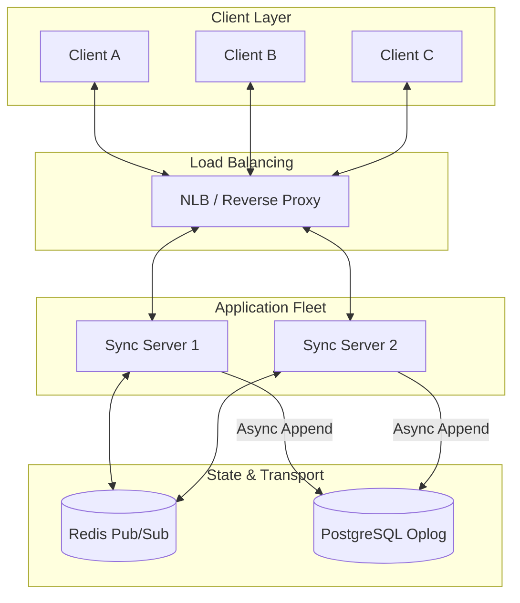

# Distributed CRDT Middleware

[](https://nodejs.org/)
[](https://www.typescriptlang.org/)
[](https://yjs.dev/)
[](https://github.com/websockets/ws)
[](https://redis.io/)
[](https://www.prisma.io/)

SyncEngine is a high-performance, distributed synchronization backend designed for real-time collaborative applications (e.g., Figma, Notion). It implements **Conflict-free Replicated Data Types (CRDTs)** to provide **Strong Eventual Consistency (SEC)** across distributed clients without the need for complex, error-prone Operational Transformation (OT) or central lock management.

---

## Architecture Overview

The system is designed as a stateless WebSocket fleet backed by a Redis Pub/Sub layer for inter-node communication and a PostgreSQL operation log for durable persistence.



---

## Engineering Design Decisions

### 1. CRDTs vs. Operational Transformation (OT)
While OT (used by Google Docs) requires a central "canonical" server to transform operations based on concurrent edits, SyncEngine uses **CRDTs (via Yjs)**.
- **Why?** CRDTs are mathematically designed to be commutative and associative. This allows updates to be applied in any order across distributed nodes while guaranteed to converge to the same state. It significantly simplifies horizontal scaling as there is no single point of truth for conflict resolution.

### 2. Synchronization Protocol: State Vector Exchange
SyncEngine implements a multi-step handshake to minimize data transfer:
- **Step 1 (Discovery):** Client sends its **State Vector** (a compact summary of known updates/clocks).
- **Step 2 (Diffing):** The server computes the missing deltas between its local state and the client's vector.
- **Step 3 (Propagation):** Only the missing binary updates are transmitted.
- **Result:** Minimal bandwidth usage even for large documents with long histories.

### 3. Binary Delta Propagation
Instead of bulky JSON payloads, SyncEngine utilizes **lib0 encoding**. Updates are propagated as raw `Uint8Array` deltas.
- **Efficiency:** Binary encoding reduces payload size by up to 10x compared to JSON, reducing GC pressure and network ingress/egress costs.

---

## Horizontal Scaling Model

SyncEngine is designed to scale horizontally across multiple instances:
- **Room-based Pub/Sub:** Every document is mapped to a Redis channel (`doc:${id}`).
- **Event Fanout:** When a client on Server A pushes an update, Server A applies it locally, publishes it to Redis, and Server B (holding connections for other clients in the same room) consumes it to broadcast to its connected peers.
- **Statelessness:** Since the CRDT state is consistent across any node that applies the updates, clients can reconnect to any server in the fleet and resume work seamlessly.

---

## Persistence & Durability Strategy

The system treats the database as an **Append-only Operation Log**:
- **Async Append:** Updates are broadcasted to WebSockets immediately for low latency, while a background process asynchronously appends the binary deltas to PostgreSQL.
- **Snapshotting (Planned):** Periodic squashing of operations into a base snapshot to prevent long replay times during initial document load.
- **Consistency Guarantee:** The system prioritizes availability for real-time edits, with eventual durability in the persistent store.

---

## Performance Benchmarks

Simulated using an internal load-testing suite with 100 concurrent clients performing rapid insertions into a shared document.

| Metric | Result | Interpretation |
| :--- | :--- | :--- |
| **Total Operations** | 1,000 | Baseline for consistency validation |
| **Throughput** | 800.00 ops/sec | Sustained message fanout across the fleet |
| **P95 Latency** | 4.5 ms | Tail latency under moderate contention |
| **Average Latency** | 2.1 ms | Round-trip overhead (Server processing + Pub/Sub) |

### Scalability Bottlenecks
- **WebSocket Fanout:** The primary bottleneck is the CPU cost of serializing/deserializing messages for hundreds of concurrent clients in a single room (N² problem).
- **Redis Throughput:** At extreme scale (100k+ concurrent rooms), Redis Pub/Sub bandwidth becomes a bottleneck, requiring cluster sharding.

---

## Internal Implementation Details

### Consistency Guarantees
- **Strong Eventual Consistency (SEC):** All nodes converge once they have received the same set of updates.
- **Causal Ordering:** Internal logic ensures that dependent operations are applied in the correct sequence using vector clocks.

### Failure Handling
- **Graceful Reconnect:** Clients implement an exponential backoff strategy. Upon reconnect, the **State Vector handshake** automatically resolves any updates missed during the downtime.
- **Idempotent Updates:** The Yjs engine ignores duplicate updates, making the synchronization protocol resilient to network retries.

---

## Project Structure

```text
backend/
├── src/
│   ├── sync.ts             # Core CRDT Logic & Y-Protocols bridge
│   ├── index.ts            # Fastify WS Server & Connection Management
│   ├── redis.ts            # High-throughput Pub/Sub Client
│   ├── documentService.ts  # Prisma Durability Layer (Oplog)
│   └── benchmark.ts        # Automated Latency/Throughput Testing
architecture/
├── system_design.md        # Deep dive into distributed patterns
└── roadmap.md              # Scaling & Feature pipeline
```

---

## Getting Started

### Prerequisites
- Node.js v20+
- Redis 7.0+
- PostgreSQL 15+

### Installation & Benchmarking
```bash
# Setup Backend
cd backend
npm install
npx prisma db push

# Start Dev Server
npm run dev

# Run Load Test
npm run benchmark
```

---

## Key Engineering Learnings
- **Binary Protocols are Non-Negotiable:** At scale, JSON overhead kills performance. Moving to `Uint8Array` was critical for sub-5ms latencies.
- **Eventual Consistency != Chaos:** Designing for SEC requires a strict understanding of commutativity in distributed state.
- **Pub/Sub Sharding:** Room-based sharding is the most effective way to prevent a single "hot" document from degrading the entire cluster.