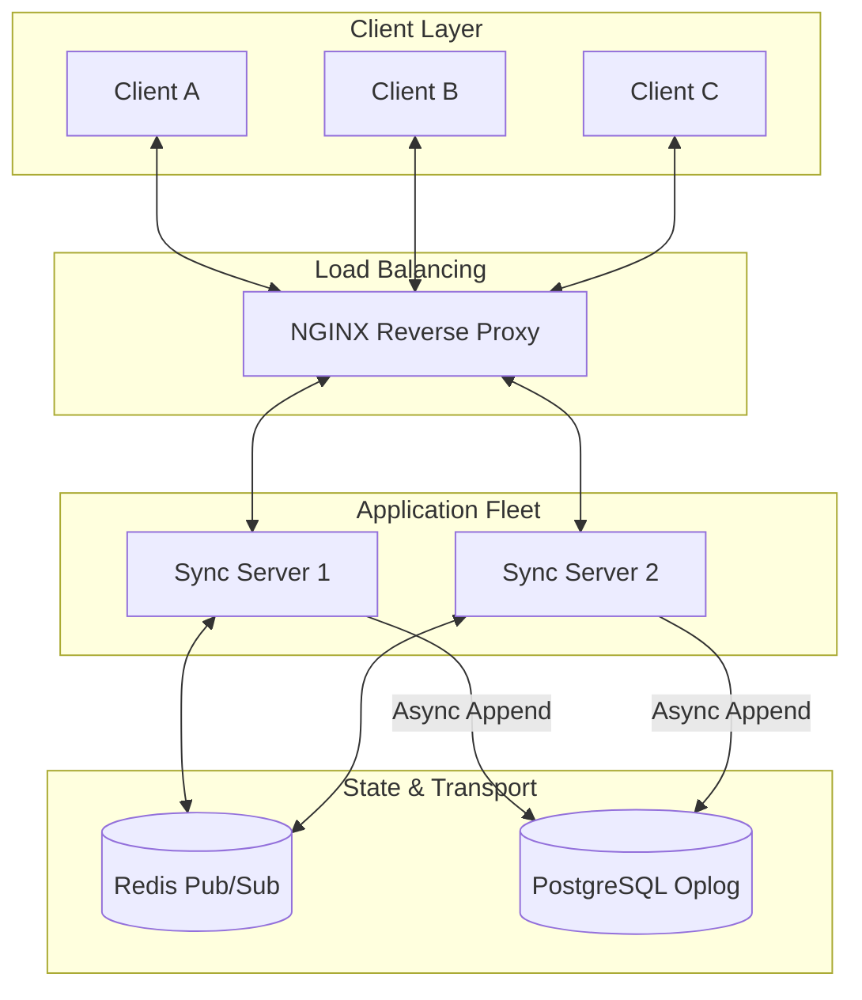

# SyncEngine: Distributed CRDT Synchronization 

SyncEngine is a custom, high-performance distributed backend for real-time collaborative applications (like Figma or Notion). It uses Conflict-free Replicated Data Types (CRDTs) to guarantee Strong Eventual Consistency (SEC) across multiple clients connected to different nodes in a distributed cluster.

Instead of relying on heavy out-of-the-box solutions or central locking mechanisms, I built this system from the ground up to solve the N² problem of WebSocket broadcasting using a stateless Node.js fleet and Redis Pub/Sub.

## Architecture

The system is designed to scale horizontally. Clients establish persistent WebSocket connections through an NGINX load balancer. The backend nodes are completely stateless—they compute missing deltas based on client state vectors and rely on Redis to fan out updates to other nodes. 



## Engineering Decisions & Tradeoffs

### 1. CRDTs over Operational Transformation (OT)
Standard collaborative editors (like older Google Docs) use OT, which requires a central "canonical" server to sequence operations. This becomes a bottleneck at scale. By using CRDTs (via Yjs), updates become commutative. Any node can apply operations in any order without conflicts, meaning the backend fleet can be completely decentralized and stateless.

### 2. Custom Binary Handshakes vs. Standard y-websocket
Initially, I prototyped with the standard `y-websocket` provider. However, it led to infinite handshake loops and massive memory overhead when handling persistent DB connections. I stripped it out and wrote a custom raw WebSocket protocol. 
Clients now send a compact **State Vector** on connection. The server computes the binary difference (`lib0` encoding) and transmits only the missing operations. This dropped payload sizes by roughly 10x compared to JSON arrays.

### 3. Redis Pub/Sub for Fleet Sync
To allow horizontal scaling behind NGINX, the servers must communicate. When Server A receives a local update from Client 1, it applies the update to its in-memory document, then publishes the raw binary delta to a Redis channel specific to that document ID (`doc:xyz`). Server B receives this pub/sub event and broadcasts it to Client 2.

### 4. Async Postgres Oplog
The primary source of truth for the session is in memory across the CRDT peers. To guarantee persistence without blocking real-time typing, the backend treats PostgreSQL strictly as an append-only operation log. Updates are flushed asynchronously.

## Running the Cluster Locally

I configured a Docker Compose environment that perfectly mimics a production distributed system. It boots an NGINX load balancer, multiple Node.js backends, Redis, and Postgres.

1. Ensure Docker is running.
2. Spin up the entire cluster:
   ```bash
   docker compose -f docker-compose.cluster.yml up --build
   ```
3. Start the Next.js frontend:
   ```bash
   cd frontend
   npm install --legacy-peer-deps
   npm run dev
   ```

When you visit `http://localhost:3000`, NGINX (`localhost:8080`) will route your WebSocket connection to one of the backend nodes. Open a second browser, and NGINX will load balance it. As you type, you can watch the state sync perfectly across the cluster via Redis.

## Tech Stack
- **Frontend**: Next.js 14, React 19, TailwindCSS, Lucide
- **Backend**: Node.js, Fastify, raw `ws`
- **State/CRDT**: Yjs, lib0 binary encoding
- **Infrastructure**: Docker, NGINX, Redis, PostgreSQL (Prisma)